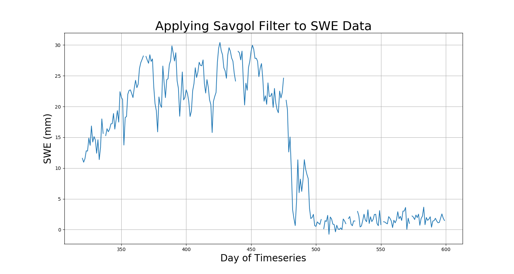
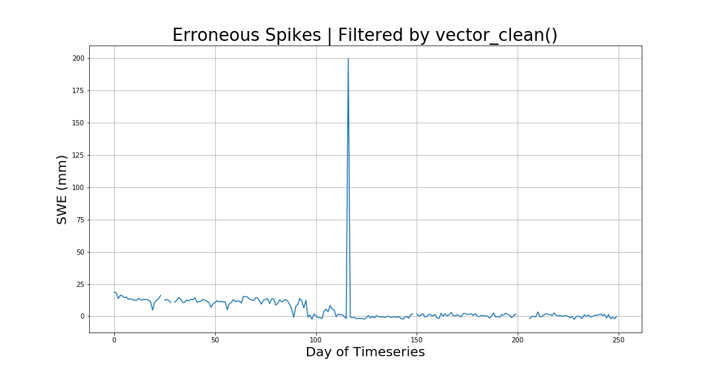
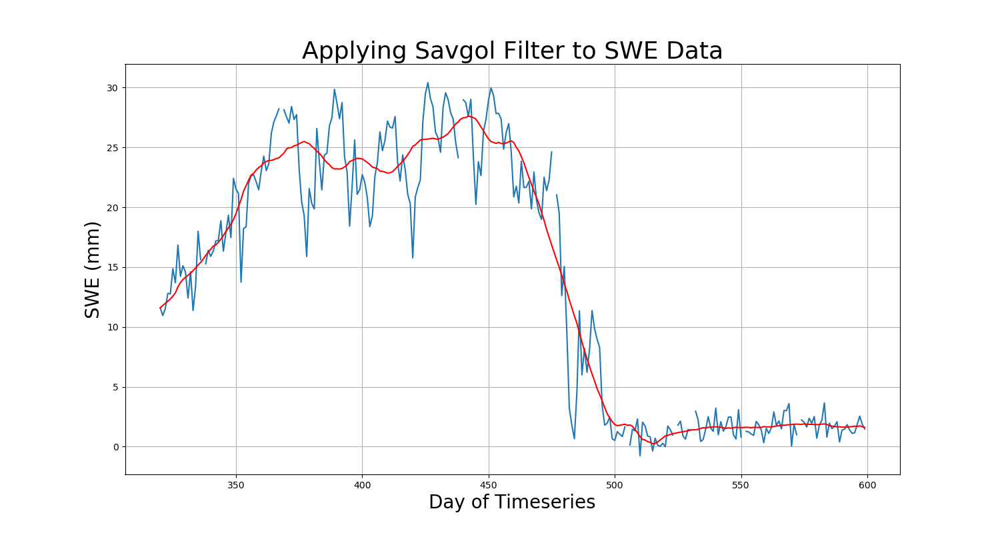

Cleaning and Filtering SWE Data with ``process``
================================================

SWEpy's ``process`` module is built to allow fast access to your temperature brightness files.
It also facilitates the cleaning of missing values and smoothing of messy data. 

We can see from the image below that the SWE curve for a single pixel can be quite messy. This 
is no suprise considering the nature of passive microwave senors. However, to glean as much useful
information as we can from this data, we want to increase the signal to noise ration as much as possible.

Obtaining smoother SWE imagery will allow us to easily derive metrics such as rate of accumulation or melt.

Opening SWE Arrays with ``get_array``
-------------------------------------

netCDF files are great for storing data, but they aren't always the easiest to work with. Especially 
since we store our 19GHz band at a lower resolution than the 37GHz band, we have to downsample one array 
to match the other anytime we want to find SWE. 

In order to save time, ``get_array`` looks at metadata of a given file to determine whether to donwsample or not.
This way, with one function call we can extract the temperature brightness and immediatly begin working with our data.

.. code-block:: python 

    tb19 = process.get_array("my_19ghz_file.nc")
    tb37 = process.get_array("my_37ghz_file.nc")

Cleaning Erroneous Data Values in TB Arrays
-------------------------------------------

SWEpy employs a simple vectorized forward fill temporally on data values that are unreasonably large or small. 

Temperature brigntness data is prone to having sudden extreme values that are clearly an error in data collection or processing.
We can see an example of one of these spikes in the figure below:

In order to effectivly smooth these arrays, we need to elmininate these spikes!

We use the time vectors because the pixels are quite large (6.25km wide) and doing some sort of nearest neighbor fill
often results in weird looking imagery, especially when looking at time series. SWE is very spatially variable, so we
want to maintain as much of that spatial information as possible. A single pixel is more like itself the day prior than
it is the pixel next to it on the same day. 

.. code-block:: python

    tb19_clean = process.vector_clean(tb19)
    tb37_clean = process.vector_clean(tb37)

Filtering Data Using a Sav-Gol Filter
-------------------------------------

As mentioned above, our goal is to increase the signal to noise ratio in the data. We ideally want to smooth temporally 
since there is more correlation between the same pixel through time than there is between different pixels. 

To smooth this data, we use a savitsky-golay filter, which uses the linear least squares method to fit a low-degree polynomial 
to successive windows of the data. 

.. code-block:: python

    tb19_filtered = process.apply_fiter(tb19_clean)
    tb37_filtered = process.apply_fiter(tb37_clean)

    swe = process.safe_subtract(tb19_filtered, tb37_filtered)

Finally, we can see the result in the figure below!

Masking Ocean Pixels from Imagery
---------------------------------

Many useful areas of interest contain ocean pixels, which may not be desireable for a given analysis. 

A simple solution to solve this is to mask them away. In order to determine which pixels to mask, SWEpy
takes a winter day and performs a jenks classification on the image. If there is snow on the ground then 
sea ice should be the first class since sea ice pixels have lower values than land pixels. 

.. code-block:: python 

    masked_cube = process.mask_ocean_winter(swe_cube, day=0, nclasses=3)